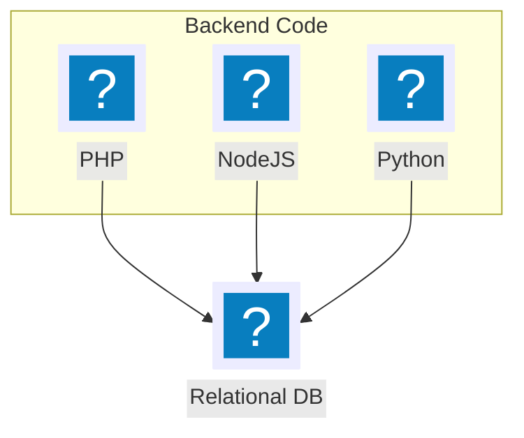

```mermaid
architecture-beta

    service server(catppuccin:javascript)[My Code]
    service db(catppuccin:folder-workflows)[File System]

    server:R --> L:db
```

# Intro to SQL

and Martin Heidegger [@OWDDM](https://owddm.com)

<style>
footer {
  position: absolute;
  bottom: 2em;
  right: 2em;
}
</style>
<footer class="text-slate-300">
Osaka, 2024/11/16
</footer>

<div class="notes" v-click>

SQL is a topic that I have learned 20 years ago. I had this very thick PHP book that I was determined to read every page of, and quite a bit of it was about how to use mysql databases with PHP. Of course at the time SQL was used. SQL is 40 years old now and over the years many have tried to replace it. But still, when I started my current work 1½ years ago, SQL was on the menu. Even though I haven’t touched it a hot bit, I had to get again into SQL. Over this year I re-learned a lot of SQL concepts and got familiar with new concepts. We accumulated quite a bit of data. Now we have several tables that are in the 10Gb+ field - a first for me and we are running into SQL performance issues every other 
week. I have to deal with SQL a fair amount these days and so I thought its a good time to dive into it together.

</div>
---

## About me

- Martin Heidegger, Austrian in Japan for 15 years
- I am a programmer for 20 years
- I like to learn more about coding
- Long time JavaScript engineer
- Freelancer for SaaS business
- These days I do a lot of PHP and Python and SQL.

---
layout: intro
---

## Today

<Toc maxDepth=1 />

- Overview: SQL topics
- Tricky SQL

<div class="notes" v-click>

In today’s presentation, I want to refresh our basic understanding of SQL. What is it? Why use it? How use it? If you have never touched SQL before, you should be able to know how to get started. Also I would like to share a few SQL general topics and terms and why they are important. Some of the topics I didn’t know or understand before. And at the end of the presentation I will go into a few, tricky SQL questions that have crossed my mind and should give some nice game-teasers for all of us in future.

</div>

---
hideInToc: false
layout: section
---

# What is the power SQL?

(Why SQL?)

---

## Code without a database




---
layout: full
hideInToc: false
---

## Code without a database

`example/fs.mjs`
```ts
import { readFile, writeFile } from 'node:fs/promises'

// Location on the file system
const storage = './tmp_storage.json'

// Read the file from the Server
const stored = JSON.parse(await readFile(storage, 'utf-8').catch(() => ('')))
console.log(stored)

// Work with the storage
stored['last_access'] = Date.now()

// Write the file at the end
await writeFile(filePath, JSON.stringify(stored))
```
<v-clicks>
```bash
$ node example/fs.mjs
{ stored {} }
```

```bash
$ node example/fs.mjs
{ stored: { last_access: 1731394601802 } }
```
</v-clicks>

---

## Basic Database features


<v-clicks>

- <mdi-bomb /> Crash Handling
- <mdi-checkbox-marked-circle-plus-outline /> Backups
- <mdi-account-multiple /> Parallel access

</v-clicks>

---

## Database speed-up


<v-clicks>

- <mdi-memory /> Use RAM and Cache not just Disk
- <mdi-server-network /> Server synchronization support
- <mdi-flash-red-eye /> Fast lookup using Indexes

</v-clicks>

---
clicks: 5
---

## Different kinds of Databases


<v-clicks>

<div v-click.hide="5"><mdi-key /> Key/Value　→　<logos-redis /> Redis</div>
<div v-click.hide="5"><mdi-file-outline /> Document　→　<logos-mongodb /></div>
<div v-click.hide="5"><mdi-graph-outline /> Graph　→　<logos-neo4j /></div>
<div><mdi-relation-one-to-one-or-many /> Relational 　→　<carbon-sql /></div>

</v-clicks>

---
title: Comparison Excel
---

## <mdi-relation-one-to-one-or-many /> Relational Databases

{width=400px lazy}

<v-clicks>

- One Database → Many tables.
- Strict Column definition per table.

</v-clicks>


---
title: SQL Servers
---

##  <mdi-relation-one-to-one-or-many /> Relational Databases

<div style="font-size: 3em; display: flex; gap: .4em; flex-direction: column; align-items: center">
<div v-click></div>
<div v-click><logos-mysql /></div>
<div v-click><logos-mariadb /></div>
<div v-click style="font-size: 0.6em"><logos-postgresql /> PostgreSQL</div>
<div v-click><logos-sqlite /></div>
</div>

---
title: SQL Servers - summary
---

##  <mdi-relation-one-to-one-or-many /> Relational Databases


- Many Choices available.
- Somewhat compatible.

---
layout: center
title: Language choice
---

<div style="width: 400px">

</div>

---
layout: center
title: Tool choice
---

<div style="width: 600px">
```mermaid
flowchart TD
  subgraph Tools
  phpmyadmin@{ img: "/images/logo-phpmyadmin.png" }
  beekeeper@{ img: "/images/logo-beekeeper-studio.png", label: "BeeKeeper Studio" }
  dbeaver@{ img: "/images/logo-dbeaver.png" }
  end

  DB@{ icon: "mdi:database", form: "square", label: "Relational DB" }

  phpmyadmin-->DB
  beekeeper-->DB
  dbeaver-->DB
```
</div>

---

## What is the power SQL?

```mermaid
architecture-beta

    service server(catppuccin:javascript)[My Code]
    service fs(catppuccin:folder-workflows)[File System]
    service db(catppuccin:database)[SQL Database]

    server:R --> L:db
    db:R --> L:fs
```

<div style="width: 360px">

</div>

<v-clicks>

- <mdi-bike-fast /> Fast Storage _(Indexes, RAM, ..)_
- <mdi-safe-square-outline /> Safe Storage _(Backups, Crashing, etc.)_
- <mdi-yoga /> Reasonably flexible _(Not just K/V)_
- <mdi-format-list-bulleted-triangle /> Many Choices _(Big/Small, Expensive/Cheap)_
- <mdi-tools /> Many tools _(40 years)_

</v-clicks>

---
hideInToc: false
layout: section
---


# How to execute/write SQL?


---

## 1. We need a server <twemoji-thinking-face />

<v-clicks>

- Use a <mdi-cloud-outline /> Hosting service? _(Linode, Sakura,...)_
- Pay money for <logos-aws-rds /> Amazon RDS?
- Launch a <logos-docker /> Container?
- Start a <mdi-server-network-outline /> Service on my server?
- Simply use <span style="font-size: 1.5em"><logos-sqlite /></span>!


</v-clicks>

---

## 1. We ~~need~~ have a server <twemoji-light-bulb />

### <logos-sqlite />

<style>
h3 {
  font-size: 1.5em;
  text-align: center;
  margin-top: 1em;
  margin-bottom: 1.2em;
}
</style>

- No separate process - file access is enough!
- Lightweight
- Good for testing

---

## 2. We need a driver <mdi-car-child-seat />

- [Node.JS](https://nodejs.org/en)
- [better-sqlite3](https://www.npmjs.com/package/better-sqlite3)

## 3. We need to