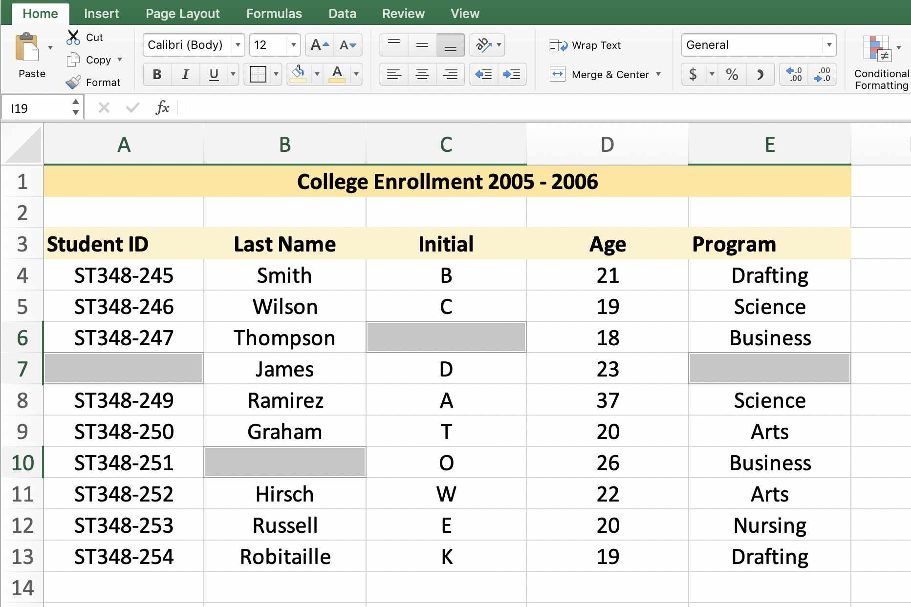
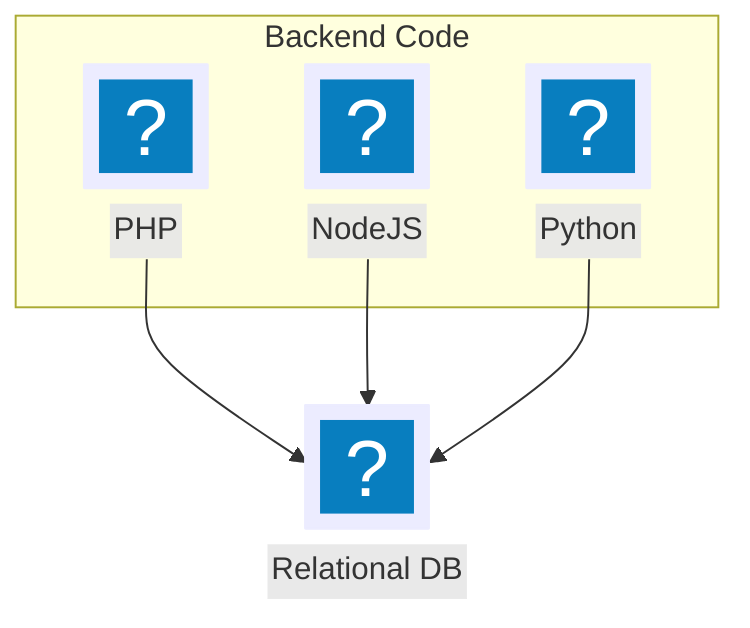
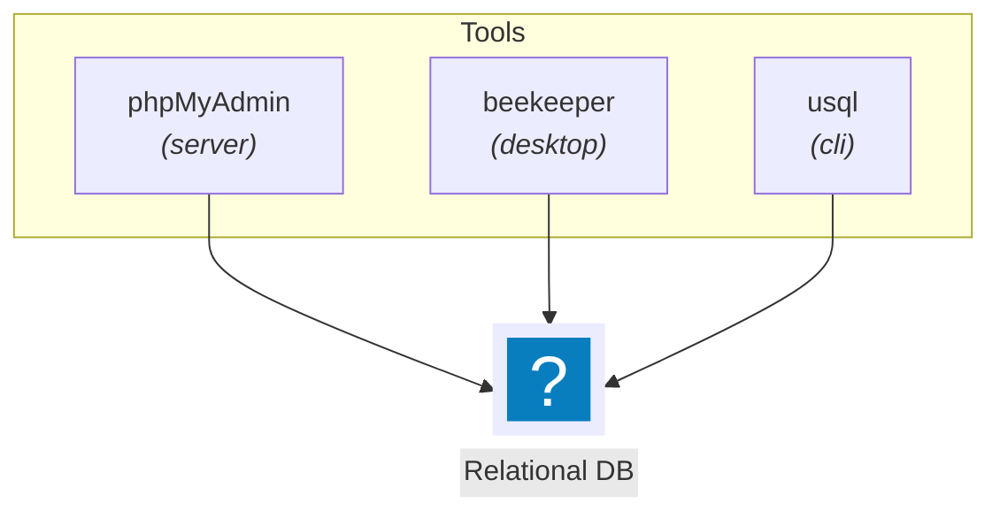

```mermaid
architecture-beta

    service server(catppuccin:javascript)[My Code]
    service db(catppuccin:folder-workflows)[File System]

    server:R --> L:db
```

# Intro to SQL

and Martin Heidegger [@OWDDM](https://owddm.com)

<style>
footer {
  position: absolute;
  bottom: 2em;
  right: 2em;
}
</style>
<footer class="text-slate-300">
Osaka, 2024/11/16
</footer>

<div class="notes" v-click>

SQL is a topic that I have learned 20 years ago. I had this very thick PHP book that I was determined to read every page of, and quite a bit of it was about how to use mysql databases with PHP. Of course at the time SQL was used. SQL is 40 years old now and over the years many have tried to replace it. But still, when I started my current work 1½ years ago, SQL was on the menu. Even though I haven’t touched it a hot bit, I had to get again into SQL. Over this year I re-learned a lot of SQL concepts and got familiar with new concepts. We accumulated quite a bit of data. Now we have several tables that are in the 10Gb+ area - a first for me and we are running into SQL performance issues every other 
week. I have to deal with SQL a fair amount these days and so I thought its a good time to dive into it together.

</div>
---

## About me

- Freelance SaaS programmer
- 20 years of Web
- Largely self & experience thought
- Mostly Frontend
- Now on an SQL adventure

---
layout: intro
---

## Today

<Toc maxDepth=1 />

<div class="notes" v-click>

In today’s presentation, I want to refresh our basic understanding of SQL. What is it? Why use it? How use it? If you have never touched SQL before, you should be able to know how to get started. Also I would like to share a few SQL general topics and terms and why they are important. Some of the topics I didn’t know or understand before. And at the end of the presentation I will go into a few advanced SQL topics that have crossed my mind and should give some nice teasers for all of us in future.

</div>

---
hideInToc: false
layout: section
---

# What is the power SQL?

(Why SQL?)

---

## Code without a database




---
layout: full
hideInToc: false
---

## Code without a database

`example/fs.mjs`
```ts
import { readFile, writeFile } from 'node:fs/promises'

// Location on the file system
const storage = './tmp_storage.json'

// Read the file from the Server
const stored = JSON.parse(await readFile(storage, 'utf-8').catch(() => ('')))
console.log(stored)

// Work with the storage
stored['last_access'] = Date.now()

// Write the file at the end
await writeFile(filePath, JSON.stringify(stored))
```
<v-clicks>
```bash
$ node example/fs.mjs
{ stored {} }
```

```bash
$ node example/fs.mjs
{ stored: { last_access: 1731394601802 } }
```
</v-clicks>

---

## Basic Database features


<v-clicks>

- <mdi-bomb /> Crash Handling
- <mdi-checkbox-marked-circle-plus-outline /> Backups
- <mdi-account-multiple /> Parallel access

</v-clicks>

---

## Database speed-up

<v-clicks>

- <mdi-memory /> Use RAM and Cache not just Disk
- <mdi-server-network /> Server synchronization support
- <mdi-flash-red-eye /> Fast lookup using Indexes

</v-clicks>

---
clicks: 7
---

## Different kinds of Databases

<v-clicks>

<div v-click.hide="7"><mdi-key /> Key/Value　→　<logos-redis /> Redis</div>
<div v-click.hide="7"><mdi-file-outline /> Document　→　<logos-mongodb /></div>
<div v-click.hide="7"><mdi-graph-outline /> Graph　→　<logos-neo4j /></div>
<div v-click.hide="7"><mdi-arrow-projectile /> 
Vector　→　<logos-chroma /> Chroma</div>
<div v-click.hide="7"><mdi-clock-out />
TimeSeries　→　<logos-crateio /> Crate.io</div>
<div><mdi-relation-one-to-one-or-many /> Relational 　→　<logos-postgresql /> PostgreSQL</div>

</v-clicks>

---
title: Comparison Excel
---

## <mdi-relation-one-to-one-or-many /> Relational Databases

{width=400px lazy}

<v-clicks>

- One Database → Many tables.
- Strict Column definition per table.

</v-clicks>


---
title: SQL Servers
---

##  <mdi-relation-one-to-one-or-many /> Relational Databases

<div style="font-size: 3em; display: flex; gap: .4em; flex-direction: column; align-items: center">
<div v-click></div>
<div v-click><logos-mysql /></div>
<div v-click><logos-mariadb /></div>
<div v-click style="font-size: 0.6em"><logos-postgresql /> PostgreSQL</div>
<div v-click><logos-sqlite /></div>
</div>

---
title: SQL Servers - summary
---

##  <mdi-relation-one-to-one-or-many /> Relational Databases

- Many Choices available.
- Somewhat compatible.

---
layout: center
title: Language choice
---

<div style="width: 400px">

</div>

---
layout: center
title: Tool choice
---

<div style="width: 600px">

</div>


---

## What is the power SQL?

```mermaid
architecture-beta

    service server(catppuccin:javascript)[My Code]
    service fs(catppuccin:folder-workflows)[File System]
    service db(catppuccin:database)[SQL Database]

    server:R --> L:db
    db:R --> L:fs
```

<div style="width: 360px">

</div>

<v-clicks>

- <mdi-bike-fast /> Fast Storage _(Indexes, RAM, ..)_
- <mdi-safe-square-outline /> Safe Storage _(Backups, Crashing, etc.)_
- <mdi-yoga /> Reasonably flexible _(Not just K/V)_
- <mdi-format-list-bulleted-triangle /> Many Choices _(Big/Small, Expensive/Cheap)_
- <mdi-tools /> Many tools _(40 years)_

</v-clicks>

---
hideInToc: false
layout: section
---


# How to execute/write SQL?


---

## 1. We need a server <twemoji-thinking-face />

<v-clicks>

- Use a <mdi-cloud-outline /> Hosting service? _(Linode, Sakura,...)_
- Pay money for <logos-aws-rds /> Amazon RDS?
- Launch a <logos-docker /> Container?
- Start a <mdi-server-network-outline /> Service on my server?
- Simply use <span style="font-size: 1.5em"><logos-sqlite /></span>!


</v-clicks>

---

## 1. We ~~need~~ have a server <twemoji-light-bulb />

### <logos-sqlite />

<style>
h3 {
  font-size: 1.5em;
  text-align: center;
  margin-top: 1em;
  margin-bottom: 1.2em;
}
</style>

- No separate process - file access is enough!
- Lightweight
- Good for testing

→ ["Why you should probably be using SQLite"](https://www.epicweb.dev/why-you-should-probably-be-using-sqlite)

---

## 2. We need a client

<v-clicks>

- <mdi-code-greater-than /> [USQL](https://github.com/xo/usql) ... `brew install xo/xo/usql` <br/>
- <mdi-application-braces /> [SQL Tools VSCode extension](https://marketplace.visualstudio.com/items?itemName=mtxr.sqltools) <br/>
- <mdi-cursor-default-click /> [Beekeeper studio](https://www.beekeeperstudio.io/)

</v-clicks>


<style>
.slidev-layout {
  font-size: 1.8rem;
  line-height: 3rem;
}
</style>

---

## 3. We start!

---
title: "Example: Very simple create"
---

`./examples/sql/01_table.sql`

<v-clicks>

```sql
-- Create a table because SQL assumes a structure
CREATE TABLE very_simple_table (id int);
```

```sql
-- Insert something
INSERT INTO very_simple_table (id) VALUES (1);
```

</v-clicks>

<style>
pre {
  --prism-font-size: 2em;
}
</style>

---
title: Flexible Syntax
---

```sql
CrEaTE    TablE very_simple_table (id int);
INSerT 

Into 
very_simple_table(id) vAlUes
(1);
```

<style>
pre {
  --prism-font-size: 2em;
}
</style>

---
title: Quick refresher
layout: full
---

```sql
-- comment
```
```sql
DROP TABLE :table_name
```
```sql
CREATE TABLE :table_name (:columns)
```
```sql
INSERT INTO :table_name (:column_a, ... :column_n)
  VALUES (:value_a, ... :value_n), ...  (:value_na, ... :value_nn)
```
```sql
SELECT (:column_a, :column_n) FROM :table_name
  WHERE :column IS :condition AND :column_n IS  :condition_2
  LIMIT :how_many_max_rows OFFSET :start_from
  ORDER BY :column_n ASC
```
```sql
UPDATE :table_name SET :column_1 = :value_1,:column_n = :value_n
WHERE :condition
```
```sql
DELETE FROM :table_name WHERE :condition
```

<style>
pre {
  --prism-font-size: 1.55em;
}
.my-auto {
  width: 100%!important;
}
</style>

---

`02_complex_table_maybe.sql`
```sql
CREATE table members (
  id INTEGER NOT NULL PRIMARY KEY AUTO_INCREMENT,
  created_at DATE(6),
  updated_at DATE(6),
  `name` VARCHAR(255),
  `rank` INT CHECK (rank >= 0 AND rank <= 10),
  INDEX rank_index (rank)
);
```

<style>
pre {
  --prism-font-size: 2em;
}
</style>

---

`03_complex_table.sql`
```sql
CREATE table members (
  id INTEGER NOT NULL PRIMARY KEY AUTOINCREMENT,
  created_at DATE(6),
  updated_at DATE(6),
  `name` VARCHAR(255),
  `rank` INT CHECK (rank >= 0 AND rank <= 10)
);
CREATE INDEX rank_index ON members(rank);
```

<style>
pre {
  --prism-font-size: 2em;
}
</style>

---
layout: section
hideInToc: false
---

# Basic SQL concepts

---
layout: center
---

### Keys

<v-clicks>

- Rows are not sorted
- Key is a unique field
- _"Primary key"_ is extra-optimized
- Usually  `id` but `<type>_id` is <twemoji-fire />

</v-clicks>

<style>
.slidev-layout {
  font-size: 1.8rem;
}
</style>
---

## Key Types

<v-clicks>

- `autoincrement` - 1,2,3,... _(not recommended_ <twemoji-person-shrugging /> _)_
- _"Compound key"_ - Multiple fields: `author` + `article`
- `UUID` - `b0cf8f59-d542-40e4-bb9c-6a8085a9792f` (v4)
- `ULID` - `01AN4Z07BY79KA1307SR9X4MV3`<br/>

    <div v-click="6">

    ```
      01AN4Z07BY79KA1307SR9X4MV3
      |----------||------------|
        Timestamp   Randomness
          48bits       80bits
    ```

    </div>
</v-clicks>

---

## Transactions

<v-clicks>

- Run multiple statements. 
- If error occurs → Revert all.
- <twemoji-turtle /> Slow~ish.

</v-clicks>

<style>
.slidev-layout {
  font-size: 1.8rem;
}
</style>

---

## Locks

<v-clicks>

- Lock rows _or_ fields _or_ ranges!
- <twemoji-snail /> Locking is **slow**!

</v-clicks>


<style>
.slidev-layout {
  font-size: 1.8rem;
}
</style>

---

## Update or Create

1.
    ```sql
    UPDATE ... WHERE id=1
    ```
2. `if (error) {` ↓
    ```sql
    CREATE (id=1)
    ```

<style>
.slidev-layout {
  font-size: 1.5em;
}
code {
  font-size: 1.5em;
}
pre {
  --prism-font-size: 1em;
}
</style>
---

## Create or Update

1.
    ```sql
    CREATE (id=1)
    ```
2. `if (error) {` ↓
    ```sql
    UPDATE ... WHERE id=1
    ```

<style>
.slidev-layout {
  font-size: 1.5em;
}
code {
  font-size: 1.5em;
}
pre {
  --prism-font-size: 1em;
}
</style>

---

## 

1.
    ```sql
    CREATE (id=1)
    ```
2. `if (error) {` ↓
    ```sql
    UPDATE ... WHERE id=1
    ```

<style>
.slidev-layout {
  font-size: 1.5em;
}
code {
  font-size: 1.5em;
}
pre {
  --prism-font-size: 1em;
}
</style>

---

---
layout: section
hideInToc: false
---

# Advanced Concepts

<div class="notes" v-click>

Now, all of the following concepts could be probably be their own talk.
But, I rather want to wow you quickly.
and hope that in a future presentation you maybe could pick up the topic.

</div>

---

## Database Proxies

<v-clicks>

- Overcome the limit of parallel connections
- Swap out the database while running
- Security Hardening
- CDN for databases

</v-clicks>

---

## Migrations 

<v-clicks>

- Learn about Migrations
- Version Fields → Lazy Migrations
- Background long time migration tasks

</v-clicks>

---

## JSON → Generated Column

- Many databases support a `json` column type.
- 
    ```json
    {
      "event": "click",
      "target": "container"
    }
    ```
-
    ```sql
    SELECT json_field->>'$.event' as event FROM table
    ```
-  It is possible to persist 👆

---

### Database Normalization

<v-clicks>

- <mdi-currency-usd-circle-outline /> That is a job!
- <mdi-check-underline/> Are all values correct?
- <mdi-check-underline/> Are all foreign keys correct?
- <mdi-check-underline/> Does all data make sense?

</v-clicks>


<style>
.slidev-layout {
  font-size: 1.7rem;
}
</style>

---

## High precision unique timestamps

- `Timestamp(6)` for microsecond precision timestamps.
- 
    ```sql
    INSERT INTO simple_table (created_at) VALUES (CURRENT_TIMESTAMP());
    ```
- Temp table with unique constraint on timestamp
- Add timestamp to the table with constraint
- All data can now be uniquely sorted

---

## My new concepts

- Database Proxies
- Migration, Slow Migration, Lazy Migration
- Generated Columns based from JSON
- Serverless DB Clusters
- High precision unique timestamps

---

# Summary

SQL is...

- <mdi-brain /> easy but complex language
- <mdi-connection /> works everywhere
- <mdi-text-box-check-outline /> gives us many options
- ... can do a lot of things
- ... is good abstraction layer
- ... can make you money

